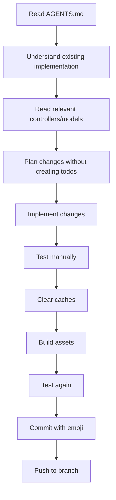

# CLAUDE.md - AI Assistant Guide for THW-Trainer-App

> **Comprehensive guide for AI assistants working with the THW-Trainer codebase**
>
> **Last Updated:** 12. Januar 2026
> **Version:** 1.0.0
> **Target:** AI Assistants (Claude, GitHub Copilot, etc.)

---

## Table of Contents

1. [Quick Start for AI Assistants](#quick-start-for-ai-assistants)
2. [Codebase Architecture Overview](#codebase-architecture-overview)
3. [Development Workflow](#development-workflow)
4. [Key Patterns & Conventions](#key-patterns--conventions)
5. [Common Tasks & How to Approach Them](#common-tasks--how-to-approach-them)
6. [Testing & Validation](#testing--validation)
7. [Security Considerations](#security-considerations)
8. [Pitfalls & Gotchas](#pitfalls--gotchas)
9. [File Navigation Guide](#file-navigation-guide)
10. [Troubleshooting](#troubleshooting)

---

## Quick Start for AI Assistants

### Before Making Any Changes

**CRITICAL: Always read these files first:**

1. **AGENTS.md** - Current implementation state, recent features, known issues
2. **README.md** - Project overview and setup instructions
3. **This file (CLAUDE.md)** - Development patterns and conventions

### First Steps Checklist

```bash
# 1. Understand current git status
git status
git log --oneline -10

# 2. Check Laravel environment
php artisan --version      # Should be Laravel 12.x
php --version              # Should be PHP 8.3.12+

# 3. Check database connection
php artisan migrate:status

# 4. Verify asset compilation
npm run build

# 5. Clear caches before working
php artisan view:clear
php artisan cache:clear
php artisan config:clear
```

### Understanding the Project Context

- **Domain:** THW (Technisches Hilfswerk) training and examination platform
- **Users:** THW trainees, instructors (Ausbildungsbeauftragte), admins
- **Language:** Mixed German (domain) + English (technical)
- **Scale:** Small-to-medium learning platform with multi-tenant features

---

## Codebase Architecture Overview

### Technology Stack

```
Backend:
├── Laravel 12.34.0 (PHP 8.3.12)
├── MySQL Database
├── Eloquent ORM
└── Policy-based Authorization

Frontend:
├── Blade Templates (Server-side rendering)
├── Tailwind CSS 3.1.0 (Utility-first)
├── Alpine.js 3.4.2 (Lightweight reactivity)
├── Vanilla JavaScript (Fetch API for AJAX)
└── Vite 7.0.4 (Asset bundling)

Infrastructure:
├── Database Sessions
├── Database Queue
├── Email (SMTP/Log)
└── No Redis/Memcached
```

### Core Domain Concepts

```
User (Helfer)
├── Practice Questions (10 Learning Sections)
├── Exams (40 questions, certification)
├── Gamification (Points, Levels, Achievements, Streaks)
├── Courses (Lehrgaenge) - Instructor-led training
└── Organizations (Ortsverbände)
    └── Learning Pools (Lernpools) - Organization-specific question sets
```

### Directory Structure Philosophy

```
/app
  ├── Http/Controllers/     → Business logic & request handling
  ├── Models/               → Data models WITH business logic (no separate repos)
  ├── Services/             → Cross-cutting services (Gamification only)
  ├── Policies/             → Authorization rules
  ├── Mail/                 → Email templates (8 types)
  └── Console/Commands/     → Scheduled tasks (10 commands)

/resources/views
  ├── layouts/              → Master layouts (app.blade.php, navigation.blade.php)
  ├── components/           → Reusable UI components (17 components)
  ├── [feature-name]/       → Feature-specific views (grouped by domain)
  └── admin/                → Admin panel views

/database/migrations        → 43 migrations (chronologically ordered)

/routes/web.php             → Single route file (18KB, well-organized)
```

---

## Development Workflow

### Standard Workflow for Feature Development



### Step-by-Step Development Process

#### 1. **Planning Phase**

```
DO:
- Read AGENTS.md for context on recent changes
- Search codebase for similar implementations
- Identify affected files (controllers, models, views, routes)
- Check for existing policies/middleware

DON'T:
- Start coding immediately
- Assume patterns from other Laravel projects
- Create files without checking if similar ones exist
```

#### 2. **Implementation Phase**

```
DO:
- Follow existing naming conventions (see below)
- Use existing components from resources/views/components/
- Reuse GamificationService for points/achievements
- Add authorization via policies (not inline checks)
- Use existing helper methods (ProgressHelper, ensureArray)

DON'T:
- Create new utility classes without need
- Bypass authorization policies
- Add dependencies without discussion
- Create duplicate components
```

#### 3. **Testing Phase**

```bash
# Always run this sequence after changes:
npm run build                    # Compile Tailwind CSS changes
php artisan view:clear           # Clear Blade cache
php artisan cache:clear          # Clear application cache
php artisan config:clear         # Clear config cache

# Then test:
# - Main functionality (happy path)
# - Edge cases (empty states, invalid input)
# - Authorization (try as different user roles)
# - Mobile view (responsive design)
# - Console for JavaScript errors
```

#### 4. **Commit Phase**

```bash
# Commit format (ALWAYS IN GERMAN):
git add -A
git commit -m "EMOJI: Beschreibung (max 4 Wörter)"

# Emoji guide:
✨  Feature/New functionality
🐛  Bug fix
📝  Documentation
🎨  UI/UX changes
⚡  Performance improvement
♻️  Refactoring
🔒  Security fix
🚀  Deployment/Build
🧪  Tests
🔧  Configuration
```

**Examples:**
```
✨ Lernpool Practice hinzugefügt
🐛 Answer Mapping Bug behoben
🎨 Modal Design verbessert
⚡ Datenbankabfragen optimiert
```

---

## Key Patterns & Conventions

### 1. Naming Conventions

| Context | Pattern | Example |
|---------|---------|---------|
| Models | PascalCase, English | `OrtsverbandLernpool`, `UserQuestionProgress` |
| Controllers | PascalCase + Controller | `OrtsverbandLernpoolController` |
| Views | kebab-case.blade.php | `show-modal.blade.php` |
| Routes | dot.notation, German | `ortsverband.lernpools.practice` |
| Database Tables | snake_case, German | `ortsverband_lernpools` |
| Methods | camelCase | `getMemberProgress()` |
| CSS Classes | Tailwind utilities | `bg-blue-600 hover:bg-blue-700` |

### 2. German vs. English Usage

```
USE GERMAN FOR:
- Domain concepts (Lehrgang, Ortsverband, Lernpool, Ausbildungsbeauftragter)
- Route names (lehrgaenge, ortsverband)
- Database table names
- User-facing text
- Commit messages
- Comments explaining business logic

USE ENGLISH FOR:
- Laravel conventions (Model, Controller, Middleware)
- Technical terms (authentication, authorization, validation)
- Code comments explaining technical implementation
- Variable names in complex algorithms
```

### 3. Authorization Pattern

**ALWAYS use Policies, NEVER inline checks:**

```php
// ❌ BAD:
if ($user->id === $lernpool->created_by) {
    // allow
}

// ✅ GOOD:
$this->authorize('update', $lernpool);

// In Policy (OrtsverbandLernpoolPolicy.php):
public function update(User $user, OrtsverbandLernpool $lernpool): bool
{
    return $user->id === $lernpool->created_by;
}
```

**Existing Policies:**
- `OrtsverbandLernpoolPolicy` - Create, update, delete, enroll, practice, unenroll
- `OrtsverbandLernpoolQuestionPolicy` - Question management

### 4. Progress Tracking Pattern

**Two-tier system (IMPORTANT):**

```
Tier 1: Consecutive Correct (UserQuestionProgress)
├── consecutive_correct = 0  → Not attempted or wrong
├── consecutive_correct = 1  → Correct once
└── consecutive_correct = 2  → MASTERED (solved)

Tier 2: User Arrays (JSON in users table)
├── solved_questions → [1, 2, 3, ...]  (IDs)
├── exam_failed_questions → [5, 7, ...]  (IDs)
└── bookmarked_questions → [10, 15, ...]  (IDs)
```

**Helper Usage:**

```php
// Get or create progress
$progress = UserQuestionProgress::getOrCreate($user->id, $question->id);

// Update progress
$progress->updateProgress($isCorrect);

// Check if mastered
if ($progress->isMastered()) {
    // Award bonus points
}

// Calculate section progress
$stats = ProgressHelper::calculateProgress($user, $lernabschnitt);
// Returns: ['solved' => 10, 'total' => 50, 'percentage' => 20]
```

### 5. Gamification Integration Pattern

**ALWAYS use GamificationService:**

```php
use App\Services\GamificationService;

class SomeController extends Controller
{
    protected GamificationService $gamification;

    public function __construct(GamificationService $gamification)
    {
        $this->gamification = $gamification;
    }

    public function answer(Request $request)
    {
        // ... validate answer ...

        if ($isCorrect) {
            // Award points
            $result = $this->gamification->addPoints(
                $user,
                10,
                'Frage richtig beantwortet'
            );

            // Check for achievements
            $this->gamification->checkAchievements($user);

            // Flash for popup
            session()->flash('gamification_result', $result);
        }
    }
}
```

**Available Achievements:**
- `first_question`, `questions_50`, `questions_100`, `questions_500`
- `exam_first_pass`, `exam_perfect_score`
- `streak_3`, `streak_7`, `streak_30`
- `speed_demon` (20 questions in one day)
- `night_owl`, `early_bird`, `all_sections_complete`

### 6. Modal System Pattern

**Event Delegation with AJAX detection:**

```html
<!-- Trigger Link -->
<a href="{{ route('ortsverband.lernpools.show', [$ortsverband, $lernpool]) }}"
   class="modal-trigger"
   data-modal-id="lernpool-modal">
    View Details
</a>

<!-- Modal Container -->
<div id="lernpool-modal" class="modal-container hidden">
    <div class="modal-content"></div>
</div>
```

```javascript
// JavaScript (auto-loaded on index pages)
document.addEventListener('click', function(e) {
    if (e.target.closest('.modal-trigger')) {
        e.preventDefault();
        const url = e.target.href + '?ajax=1&_t=' + Date.now();

        fetch(url, {
            headers: { 'X-Requested-With': 'XMLHttpRequest' },
            cache: 'no-store'
        })
        .then(response => response.text())
        .then(html => {
            modalContent.innerHTML = html;
            modal.classList.remove('hidden');
        });
    }
});
```

```php
// Controller - AJAX Detection
public function show(Ortsverband $ortsverband, OrtsverbandLernpool $lernpool)
{
    $this->authorize('view', $lernpool);

    // Check for AJAX request
    if (request()->ajax() ||
        request()->header('X-Requested-With') === 'XMLHttpRequest' ||
        request()->query('ajax') === '1') {

        return view('ortsverband.lernpools.show-modal', compact('lernpool'));
    }

    return view('ortsverband.lernpools.show', compact('ortsverband', 'lernpool'));
}
```

**Cache-Busting is REQUIRED:**
- Add `?_t=Date.now()` to all AJAX URLs
- Use `cache: 'no-store'` in fetch options
- Add cache headers in modal responses

### 7. Practice Mode Pattern

**Single Question Display (NOT all at once):**

```
Flow:
1. User visits practice route
2. Controller selects ONE question (prioritized/random)
3. View displays question with shuffled answers
4. User submits answer
5. Controller processes answer → updates progress → awards points
6. Redirect back to practice route (shows NEXT question)
7. Repeat until no questions left or user quits
```

**Implementation Details:**

```php
// Select question (priority: failed > unsolved > random)
$question = Question::whereNotIn('id', $solvedIds)
    ->inRandomOrder()
    ->first();

// Shuffle answers (store mapping in form)
$answers = [
    'A' => $question->antwort_a,
    'B' => $question->antwort_b,
    'C' => $question->antwort_c,
];
$shuffled = collect($answers)->shuffle();
$mapping = $shuffled->keys()->all(); // e.g., ['B', 'A', 'C']

// In view:
<input type="hidden" name="answer_mapping" value="{{ json_encode($mapping) }}">

// On submit:
$userPositions = $request->input('answer'); // e.g., ['0', '2']
$mapping = json_decode($request->input('answer_mapping'), true);
$userLetters = array_map(fn($pos) => $mapping[$pos], $userPositions);
sort($userLetters);
$userAnswer = implode(',', $userLetters); // e.g., "A,C"

// Compare:
$correctAnswer = $question->loesung; // e.g., "A,C"
$isCorrect = ($userAnswer === $correctAnswer);
```

### 8. Blade Component Pattern

**Use existing components, don't reinvent:**

```php
// Button components
<x-primary-button>Save</x-primary-button>
<x-secondary-button>Cancel</x-secondary-button>
<x-danger-button>Delete</x-danger-button>

// Form components
<x-input-label for="name" value="Name" />
<x-text-input id="name" name="name" :value="old('name')" />
<x-input-error :messages="$errors->get('name')" />

// Modal
<x-modal name="confirm-delete" :show="$errors->isNotEmpty()">
    <!-- Modal content -->
</x-modal>

// Achievement popup (auto-displayed via session)
<x-achievement-popup />

// Gamification notifications
<x-gamification-notifications />
```

### 9. Session Flash Pattern

**For temporary feedback (practice answers, gamification):**

```php
// In controller (after answer processing):
session()->flash('answer_result', [
    'is_correct' => true,
    'user_answer' => 'A,B',
    'correct_answer' => 'A,B',
    'question_progress' => $progress,
    'answer_mapping' => $mapping,
]);

session()->flash('gamification_result', [
    'points_awarded' => 10,
    'reason' => 'Frage richtig beantwortet',
    'new_level' => $user->level,
    'achievement_unlocked' => 'questions_50',
]);

return redirect()->route('ortsverband.lernpools.practice', [$ortsverband, $lernpool]);
```

```blade
<!-- In view (practice.blade.php) -->
@if (session('answer_result'))
    @php $result = session('answer_result'); @endphp

    @if ($result['is_correct'])
        <div class="bg-green-100 border-green-500">
            ✓ Richtig!
        </div>
    @else
        <div class="bg-red-100 border-red-500">
            ✗ Falsch. Richtige Antwort: {{ $result['correct_answer'] }}
        </div>
    @endif
@endif

<!-- Gamification popup (auto-displayed by component) -->
<x-gamification-notifications />
```

**IMPORTANT:** Flash data persists for ONE request only. Don't manually forget unless necessary.

---

## Common Tasks & How to Approach Them

### Task 1: Adding a New Feature to Lernpools

**Example: Add bulk delete questions**

```
1. Read existing code:
   - app/Http/Controllers/OrtsverbandLernpoolQuestionController.php
   - app/Policies/OrtsverbandLernpoolQuestionPolicy.php
   - resources/views/ortsverband/lernpools/questions/index-modal.blade.php

2. Plan implementation:
   - Add 'bulkDelete' method to controller
   - Add 'bulkDelete' policy method (check creator)
   - Add checkbox UI in view
   - Add "Delete Selected" button with confirmation

3. Implement:
   - Route: POST /ortsverband/{id}/lernpools/{lernpool}/questions/bulk-delete
   - Policy check in controller
   - Transaction for bulk delete
   - Flash success message

4. Test:
   - As creator: should work
   - As non-creator: should see 403
   - As unauthenticated: should redirect to login
   - Empty selection: should show validation error
   - Mobile view: checkboxes should be touch-friendly

5. Commit:
   git commit -m "✨ Bulk Delete für Lernpool-Fragen"
```

### Task 2: Fixing a Bug

**Example: Modal shows stale data**

```
1. Reproduce bug:
   - Open modal
   - Edit data
   - Close modal
   - Reopen modal → OLD DATA SHOWN

2. Diagnose:
   - Check browser cache (likely culprit)
   - Check if cache headers are set
   - Check if timestamp is added to URL

3. Fix:
   - Add ?_t=Date.now() to AJAX URL
   - Add cache: 'no-store' to fetch
   - Add Cache-Control header in controller response

4. Verify fix:
   - Clear browser cache completely
   - Test again
   - Check Network tab (should see no cache hit)

5. Commit:
   git commit -m "🐛 Modal Cache-Problem behoben"
```

### Task 3: Adding a New Model/Table

**Example: Add comments to Lernpool questions**

```
1. Plan schema:
   CREATE TABLE ortsverband_lernpool_question_comments (
       id BIGINT UNSIGNED AUTO_INCREMENT PRIMARY KEY,
       question_id BIGINT UNSIGNED NOT NULL,
       user_id BIGINT UNSIGNED NOT NULL,
       comment TEXT NOT NULL,
       created_at TIMESTAMP,
       updated_at TIMESTAMP,
       FOREIGN KEY (question_id) REFERENCES ortsverband_lernpool_questions(id) ON DELETE CASCADE,
       FOREIGN KEY (user_id) REFERENCES users(id) ON DELETE CASCADE
   );

2. Create migration:
   php artisan make:migration create_ortsverband_lernpool_question_comments_table

3. Create model:
   php artisan make:model OrtsverbandLernpoolQuestionComment

4. Add relationships:
   // In OrtsverbandLernpoolQuestionComment.php
   public function question() {
       return $this->belongsTo(OrtsverbandLernpoolQuestion::class, 'question_id');
   }

   public function user() {
       return $this->belongsTo(User::class);
   }

   // In OrtsverbandLernpoolQuestion.php
   public function comments() {
       return $this->hasMany(OrtsverbandLernpoolQuestionComment::class, 'question_id');
   }

5. Create controller:
   php artisan make:controller OrtsverbandLernpoolQuestionCommentController

6. Add routes:
   Route::post('/ortsverband/{ortsverband}/lernpools/{lernpool}/questions/{question}/comments',
       [OrtsverbandLernpoolQuestionCommentController::class, 'store'])
       ->name('ortsverband.lernpools.questions.comments.store');

7. Create views:
   - resources/views/ortsverband/lernpools/questions/comments/create.blade.php
   - resources/views/ortsverband/lernpools/questions/comments/index.blade.php

8. Test thoroughly (see testing section)

9. Commit:
   git commit -m "✨ Kommentar-System für Lernpool-Fragen hinzugefügt"
```

### Task 4: Updating UI/Design

**Example: Improve mobile responsiveness**

```
1. Identify problem areas:
   - Use browser dev tools (mobile view)
   - Test on actual mobile device if possible
   - Check for overflow, touch targets, font sizes

2. Use Tailwind responsive classes:
   <!-- Mobile-first approach -->
   <div class="flex flex-col space-y-4 md:flex-row md:space-y-0 md:space-x-4">
       <!-- Content adapts to screen size -->
   </div>

3. Common responsive patterns:
   - Text: text-sm md:text-base
   - Padding: p-4 md:p-6
   - Grid: grid-cols-1 md:grid-cols-2 lg:grid-cols-3
   - Hide on mobile: hidden md:block
   - Show only on mobile: block md:hidden

4. Check touch targets (minimum 48x48px):
   <button class="min-h-[48px] min-w-[48px] touch-manipulation">

5. Test:
   - Chrome DevTools mobile emulation
   - Safari Responsive Design Mode
   - Actual mobile device

6. Build assets:
   npm run build

7. Commit:
   git commit -m "🎨 Mobile Ansicht verbessert"
```

#### Modern Dashboard Design Pattern

**WICHTIG: Verwende dieses Design-Pattern für alle Dashboard/Admin-Seiten:**

```html
<!-- Moderne Überschrift mit Farbverlauf -->
<div class="dashboard-header">
    <h1 class="dashboard-greeting">📚 <span>Überschrift</span></h1>
    <p class="dashboard-subtitle">Beschreibung</p>
</div>
```

```css
/* CSS für Farbverlauf in der Überschrift */
.dashboard-greeting {
    font-size: 2.5rem;
    font-weight: 800;
    color: #00337F;
    margin-bottom: 0.5rem;
    line-height: 1.2;
}

.dashboard-greeting span {
    display: inline-block;
    background: linear-gradient(90deg, #fbbf24, #f59e0b);
    -webkit-background-clip: text;
    -webkit-text-fill-color: transparent;
    background-clip: text;
}
```

**Wichtige Design-Elemente:**
- **Gradient-Text**: Verwende `<span>` um den Haupttext mit goldenem Farbverlauf (#fbbf24 → #f59e0b)
- **Emoji-Icons**: Füge passende Emojis VOR dem Text hinzu (nicht im span)
- **Statistik-Karten**: Mit Hover-Effekten und Icons
- **Moderne Buttons**: Mit Gradient-Hintergründen und Hover-Animationen
- **Info-Cards**: Mit abgerundeten Ecken und Schatten
- **Responsive**: Mobile-first Ansatz mit Media Queries

### Task 5: Optimizing Database Queries

**Example: N+1 query problem in Lernpool index**

```
1. Identify problem:
   - Install laravel-debugbar: composer require barryvdh/laravel-debugbar
   - Check query count (should be < 20 for index page)
   - Use DB::listen() to log queries in local

2. Fix with eager loading:
   // ❌ BAD (N+1 queries):
   $lernpools = OrtsverbandLernpool::all();
   foreach ($lernpools as $pool) {
       echo $pool->creator->name; // +1 query per pool
       echo $pool->questions->count(); // +1 query per pool
   }

   // ✅ GOOD (2-3 queries):
   $lernpools = OrtsverbandLernpool::with(['creator', 'questions'])->get();
   foreach ($lernpools as $pool) {
       echo $pool->creator->name; // No query
       echo $pool->questions->count(); // No query
   }

3. Use query scopes for common patterns:
   // In OrtsverbandLernpool model
   public function scopeWithStats($query) {
       return $query->with(['creator', 'questions'])
                    ->withCount(['enrollments', 'questions']);
   }

   // Usage:
   $lernpools = OrtsverbandLernpool::withStats()->get();

4. Add indexes for foreign keys (check migrations):
   $table->foreign('lernpool_id')->references('id')->on('ortsverband_lernpools');
   $table->index('lernpool_id'); // Add this if missing

5. Test performance:
   - Before: Count queries
   - After: Count queries (should be significantly fewer)
   - Use Laravel Telescope for production monitoring

6. Commit:
   git commit -m "⚡ Lernpool Queries optimiert"
```

---

## Testing & Validation

### Manual Testing Checklist

After every change, test the following:

#### 1. **Functionality Testing**

```
[ ] Happy path works correctly
[ ] Edge cases handled (empty states, null values)
[ ] Validation errors display correctly
[ ] Success messages appear
[ ] Data persists in database
[ ] Redirects go to correct pages
```

#### 2. **Authorization Testing**

Test as different user roles:

```
[ ] Unauthenticated user (should redirect to login)
[ ] Regular user (should see only own data)
[ ] Ausbildungsbeauftragter (should see org data, can create)
[ ] Admin (should see everything)
[ ] Member of different Ortsverband (should NOT see)
```

#### 3. **UI/UX Testing**

```
[ ] Desktop view (1920x1080)
[ ] Tablet view (768x1024)
[ ] Mobile view (375x667)
[ ] Touch targets >= 48x48px
[ ] Text readable (contrast, size)
[ ] No horizontal scroll
[ ] Buttons have hover/active states
[ ] Forms have focus states
[ ] Loading states for AJAX
```

#### 4. **Browser Testing**

```
[ ] Chrome/Edge (Chromium)
[ ] Firefox
[ ] Safari (if available)
[ ] Mobile Safari (iPhone)
[ ] Mobile Chrome (Android)
```

#### 5. **JavaScript Console**

```
[ ] No errors in console
[ ] No warnings (unless acceptable)
[ ] Network requests succeed (200/302)
[ ] AJAX requests return expected data
```

### Testing Database Changes

```bash
# Test migrations
php artisan migrate:fresh --seed  # ⚠️ DESTROYS DATA, local only!

# Test rollback
php artisan migrate:rollback

# Check migration status
php artisan migrate:status

# Generate fresh test data
php artisan db:seed
```

### Testing Email

```bash
# Use log driver in .env for local testing
MAIL_MAILER=log

# Check emails in storage/logs/laravel.log
tail -f storage/logs/laravel.log

# Test specific email
php artisan tinker
>>> $user = User::first();
>>> Mail::to($user->email)->send(new \App\Mail\InactiveReminderMail($user));
>>> exit
```

### Performance Testing

```bash
# Check query count with laravel-debugbar
composer require barryvdh/laravel-debugbar --dev

# Clear all caches before testing
php artisan optimize:clear

# Measure page load time
php artisan route:list  # Check route names
time curl http://localhost:8000/dashboard  # Should be < 1s
```

---

## Security Considerations

### 1. **Always Validate Input**

```php
// ❌ BAD:
$question = Question::find($request->input('question_id'));

// ✅ GOOD:
$validated = $request->validate([
    'question_id' => 'required|exists:questions,id',
]);
$question = Question::findOrFail($validated['question_id']);
```

### 2. **Always Authorize Actions**

```php
// ❌ BAD:
$lernpool->delete();

// ✅ GOOD:
$this->authorize('delete', $lernpool);
$lernpool->delete();
```

### 3. **Protect Against Mass Assignment**

```php
// In Model:
protected $fillable = ['name', 'description']; // Whitelist

// OR

protected $guarded = ['id', 'created_by']; // Blacklist

// ❌ BAD:
$user->update($request->all()); // Can modify ANY column

// ✅ GOOD:
$user->update($request->validated()); // Only validated fields
```

### 4. **CSRF Protection**

```blade
<!-- Always include in forms -->
<form method="POST" action="{{ route('...') }}">
    @csrf
    <!-- ... -->
</form>

<!-- For DELETE/PUT -->
<form method="POST" action="{{ route('...') }}">
    @csrf
    @method('DELETE')
    <!-- ... -->
</form>
```

### 5. **SQL Injection Prevention**

```php
// ❌ BAD:
DB::select("SELECT * FROM users WHERE email = '{$email}'");

// ✅ GOOD (Eloquent uses parameter binding automatically):
User::where('email', $email)->first();

// ✅ GOOD (Manual binding):
DB::select("SELECT * FROM users WHERE email = ?", [$email]);
```

### 6. **XSS Prevention**

```blade
<!-- ❌ BAD (unescaped): -->
{!! $userInput !!}

<!-- ✅ GOOD (escaped by default): -->
{{ $userInput }}

<!-- Only use {!! !!} for TRUSTED content: -->
{!! $trustedHtmlFromEditor !!}
```

### 7. **Rate Limiting**

```php
// Already applied to:
// - Login: 5 attempts per minute
// - Registration: 5 attempts per minute
// - Password reset: 5 attempts per hour
// - Contact form: 3 attempts per hour

// Add to new routes if needed:
Route::post('/api/something', [Controller::class, 'method'])
    ->middleware('throttle:60,1'); // 60 requests per minute
```

### 8. **File Upload Security (if adding)**

```php
// Validate file type, size, mime
$request->validate([
    'file' => 'required|file|mimes:pdf,jpg,png|max:2048', // 2MB
]);

// Store in non-public directory
$path = $request->file('file')->store('uploads', 'private');

// Or with custom filename
$filename = Str::random(40) . '.' . $file->extension();
$path = $file->storeAs('uploads', $filename, 'private');
```

---

## Pitfalls & Gotchas

### 1. **Column Name Inconsistency (RESOLVED)**

**Issue:** Code used `ortsverband_lernpool_id` but DB column is `lernpool_id`

**Solution:** Always use `lernpool_id` in queries and policies

```php
// ❌ BAD (old code):
->where('ortsverband_lernpool_id', $lernpoolId)

// ✅ GOOD:
->where('lernpool_id', $lernpoolId)
```

### 2. **Route Naming Inconsistency (RESOLVED)**

**Issue:** Some routes used short names (`practice`, `answer`) instead of full qualified names

**Solution:** Always use full route names with prefix

```php
// ❌ BAD:
route('practice')

// ✅ GOOD:
route('ortsverband.lernpools.practice', [$ortsverband, $lernpool])
```

### 3. **Modal Caching Issue (RESOLVED)**

**Issue:** Modals showed stale/cached content

**Solution:** Always add cache-busting to AJAX requests

```javascript
// ✅ GOOD:
const url = link.href + '?ajax=1&_t=' + Date.now();
fetch(url, {
    headers: { 'X-Requested-With': 'XMLHttpRequest' },
    cache: 'no-store'
});
```

### 4. **Lernabschnitt Display Format**

**Expected:** "1.33" means Lernabschnitt 1, Frage 33

```php
// Display format:
$displayNumber = $question->lernabschnitt . '.' . $question->nummer;
// Result: "1.33"
```

### 5. **Lösung (Solution) Format**

**ALWAYS store as comma-separated string, sorted alphabetically:**

```php
// ❌ BAD:
$loesung = ['A', 'C', 'B']; // Array
$loesung = 'C,A'; // Unsorted

// ✅ GOOD:
$loesung = 'A,C'; // String, sorted
```

**Multi-select support:**
- Single answer: "A" or "B" or "C"
- Multiple answers: "A,B" or "A,C" or "B,C" or "A,B,C"

### 6. **Fragenummer (Question Number) Auto-Fill**

Logic: Next number = max(current numbers in this section) + 1

```php
$nextNumber = OrtsverbandLernpoolQuestion::where('lernpool_id', $lernpool->id)
    ->where('lernabschnitt', $lernabschnitt)
    ->max('nummer') + 1;

// Fallback if no questions in section:
$nextNumber = $nextNumber ?: 1;
```

**User can override:** Field is NOT readonly

### 7. **Session Flash Data Persistence**

**IMPORTANT:** Flash data persists for ONE redirect only

```php
// ❌ BAD (will lose data):
session()->flash('message', 'Success');
return view('page'); // Flash data NOT available

// ✅ GOOD:
session()->flash('message', 'Success');
return redirect()->route('page'); // Flash data available in next request

// ✅ ALSO GOOD (manual forget if needed):
$data = session('message');
session()->forget('message'); // Explicitly remove
```

### 8. **User Role Column Name (TYPO IN SCHEMA)**

**WARNING:** There's a typo in users table

```php
// Current schema has:
$table->string('useroll')->default('user'); // ← TYPO

// Should be:
$table->string('user_role')->default('user');

// For now, use:
$user->useroll === 'admin' // Check admin status
$user->is_admin // Also exists as boolean (use this instead)
```

### 9. **Progress Array vs. Progress Model**

**Two systems exist (NOT a bug, by design):**

```
System 1: UserQuestionProgress model
- consecutive_correct (0/1/2)
- Used for "mastered" status
- Separate from User model

System 2: User JSON arrays
- solved_questions (IDs)
- exam_failed_questions (IDs)
- Legacy system, but still used

ALWAYS update BOTH when processing answers.
```

### 10. **Alpine.js x-data Scope**

**Alpine requires x-data on parent element:**

```html
<!-- ❌ BAD: -->
<div>
    <button @click="open = true">Open</button>
    <div x-show="open">Content</div>
</div>

<!-- ✅ GOOD: -->
<div x-data="{ open: false }">
    <button @click="open = true">Open</button>
    <div x-show="open">Content</div>
</div>
```

---

## File Navigation Guide

### Quick Reference: Where to Find Things

```
Feature: User Authentication
├── Controllers: app/Http/Controllers/Auth/
├── Views: resources/views/auth/
├── Routes: routes/auth.php
└── Mail: app/Mail/VerifyRegistrationMail.php

Feature: Practice Mode
├── Controller: app/Http/Controllers/PracticeController.php
├── View: resources/views/practice.blade.php
├── Helper: app/Helpers/ProgressHelper.php
└── Model: app/Models/UserQuestionProgress.php

Feature: Exams
├── Controller: app/Http/Controllers/ExamController.php
├── Views: resources/views/exam.blade.php, exam-result.blade.php
├── Model: app/Models/ExamStatistic.php
└── Service: app/Services/GamificationService.php

Feature: Courses (Lehrgaenge)
├── Controller: app/Http/Controllers/LehrgangController.php
├── Views: resources/views/lehrgaenge/
├── Models: app/Models/Lehrgang.php, LehrgangQuestion.php, etc.
└── Migrations: database/migrations/*_create_lehrgaenge_*.php

Feature: Organizations (Ortsverbände)
├── Controller: app/Http/Controllers/OrtsverbandController.php
├── Views: resources/views/ortsverband/
├── Models: app/Models/Ortsverband.php
├── Middleware: app/Http/Middleware/OrtsverbandAusbildungsbeauftragterMiddleware.php
└── Migrations: database/migrations/*_create_ortsverbände_*.php

Feature: Learning Pools (Lernpools)
├── Controllers:
│   ├── app/Http/Controllers/OrtsverbandLernpoolController.php
│   ├── app/Http/Controllers/OrtsverbandLernpoolQuestionController.php
│   └── app/Http/Controllers/OrtsverbandLernpoolPracticeController.php
├── Views: resources/views/ortsverband/lernpools/
├── Models:
│   ├── app/Models/OrtsverbandLernpool.php
│   ├── app/Models/OrtsverbandLernpoolQuestion.php
│   ├── app/Models/OrtsverbandLernpoolEnrollment.php
│   └── app/Models/OrtsverbandLernpoolProgress.php
├── Policy: app/Policies/OrtsverbandLernpoolPolicy.php
└── Migrations: database/migrations/*_create_ortsverband_lernpool_*.php

Feature: Gamification
├── Service: app/Services/GamificationService.php (MAIN)
├── Components:
│   ├── resources/views/components/achievement-popup.blade.php
│   └── resources/views/components/gamification-notifications.blade.php
└── User Model: app/Models/User.php (achievements, points, level, streaks)

Feature: Admin Panel
├── Controllers: app/Http/Controllers/Admin/
├── Views: resources/views/admin/
├── Middleware: app/Http/Middleware/AdminMiddleware.php
└── Routes: routes/web.php (prefix 'admin', middleware 'admin')

Feature: Emails & Notifications
├── Mail: app/Mail/ (8 mail classes)
├── Views: resources/views/emails/
└── Commands: app/Console/Commands/ (10 scheduled tasks)

Configuration:
├── Environment: .env
├── Laravel Config: config/
├── Vite: vite.config.js
├── Tailwind: tailwind.config.js
├── Composer: composer.json
└── NPM: package.json

Documentation:
├── AGENTS.md (Implementation details, recent changes)
├── CLAUDE.md (This file - Development guide)
└── README.md (Project overview, setup)
```

### How to Search for Code

```bash
# Find all controllers for a feature
ls -la app/Http/Controllers/*Lernpool*

# Find all views for a feature
find resources/views -name "*lernpool*"

# Find where a route is defined
grep -r "route('ortsverband.lernpools" .

# Find where a model is used
grep -r "OrtsverbandLernpool::" app/

# Find all migrations
ls -la database/migrations/

# Find specific migration
ls -la database/migrations/*lernpool*

# Find where a service is injected
grep -r "GamificationService" app/Http/Controllers/

# Find all policies
ls -la app/Policies/

# Find where a policy is used
grep -r "authorize('create'" app/Http/Controllers/

# Find all middleware
ls -la app/Http/Middleware/

# Find where middleware is applied
grep -r "middleware('admin')" routes/

# Find all Blade components
ls -la resources/views/components/

# Find component usage
grep -r "<x-achievement-popup" resources/views/
```

---

## Troubleshooting

### Common Issues & Solutions

#### Issue: "Route not found" error

```
Symptoms: 404 error, route name not recognized

Solutions:
1. Clear route cache: php artisan route:clear
2. Check route name: php artisan route:list | grep "lernpool"
3. Verify route parameters match: route('name', [$param1, $param2])
4. Check middleware doesn't block route
```

#### Issue: "View not found" error

```
Symptoms: View [name] not found

Solutions:
1. Clear view cache: php artisan view:clear
2. Check file exists: ls -la resources/views/path/to/view.blade.php
3. Check spelling (case-sensitive on Linux)
4. Check dots match directories: 'ortsverband.lernpools.show' = ortsverband/lernpools/show.blade.php
```

#### Issue: "Column not found" in database

```
Symptoms: SQLSTATE[42S22]: Column not found

Solutions:
1. Check migration ran: php artisan migrate:status
2. Run migrations: php artisan migrate
3. Check column name in model: $fillable, $guarded
4. Check query uses correct column name (lernpool_id not ortsverband_lernpool_id)
```

#### Issue: Changes not reflecting in browser

```
Symptoms: Old content still visible, CSS not applied

Solutions:
1. Hard refresh: Cmd+Shift+R (Mac) or Ctrl+Shift+R (Windows)
2. Clear browser cache completely
3. Clear Laravel caches:
   php artisan view:clear
   php artisan cache:clear
   php artisan config:clear
4. Rebuild assets: npm run build
5. Restart Laravel server: php artisan serve
6. Check browser console for 304 (cached) responses
```

#### Issue: Modal shows old/stale content

```
Symptoms: Modal doesn't reflect recent changes

Solutions:
1. Add cache-busting: ?_t=Date.now()
2. Add cache: 'no-store' to fetch
3. Clear browser cache
4. Check Network tab in DevTools (should see no cache)
```

#### Issue: "This action is unauthorized"

```
Symptoms: 403 error, authorization failed

Solutions:
1. Check policy: app/Policies/[Model]Policy.php
2. Check user has correct role/permission
3. Check authorize() call in controller
4. Check policy is registered in AppServiceProvider
5. Try as different user (admin, creator, member)
```

#### Issue: JavaScript not working

```
Symptoms: Buttons don't respond, Alpine directives don't work

Solutions:
1. Check browser console for errors
2. Rebuild assets: npm run build
3. Clear view cache: php artisan view:clear
4. Check x-data is on parent element (Alpine)
5. Check event listeners are attached
6. Check for conflicting JavaScript libraries
```

#### Issue: Tailwind classes not applied

```
Symptoms: Styles not showing, classes seem ignored

Solutions:
1. Rebuild assets: npm run build
2. Check class is in safelist (tailwind.config.js) if dynamic
3. Clear view cache: php artisan view:clear
4. Check for typos in class names
5. Check class is valid Tailwind utility
6. Hard refresh browser
```

#### Issue: Gamification not working

```
Symptoms: Points not awarded, achievements not unlocked

Solutions:
1. Check GamificationService is injected in controller
2. Check addPoints() is called after correct answer
3. Check checkAchievements() is called
4. Check session flash is set: session()->flash('gamification_result', ...)
5. Check component is included: <x-gamification-notifications />
6. Check user model has achievements array column
```

#### Issue: Email not sending

```
Symptoms: No email received

Solutions:
1. Check .env: MAIL_MAILER=log (local) or smtp (production)
2. Check logs: storage/logs/laravel.log
3. Check queue is running: php artisan queue:work
4. Check user has email_consent=true (for reminders)
5. Test in tinker: Mail::to('test@example.com')->send(new SomeMail());
```

#### Issue: Database seeder fails

```
Symptoms: Error during php artisan db:seed

Solutions:
1. Check foreign key constraints are created in correct order
2. Check factories are defined correctly
3. Use transaction in seeder for rollback on error
4. Check data being seeded is valid (e.g., email format)
```

#### Issue: Migration fails to rollback

```
Symptoms: Error during php artisan migrate:rollback

Solutions:
1. Check down() method exists in migration
2. Check foreign keys are dropped before tables
3. Manually drop tables if needed: DB::statement('DROP TABLE...')
4. Check migration order (reverse of up)
```

---

## Development Commands Cheatsheet

### Essential Daily Commands

```bash
# Start development server
php artisan serve

# Watch for frontend changes (dev mode)
npm run dev

# Build production assets
npm run build

# Clear all caches (run after any code change)
php artisan optimize:clear
# OR individually:
php artisan view:clear
php artisan cache:clear
php artisan config:clear
php artisan route:clear

# Check routes
php artisan route:list
php artisan route:list | grep "lernpool"

# Check migrations status
php artisan migrate:status

# Run migrations
php artisan migrate

# Rollback last migration
php artisan migrate:rollback

# Fresh migration + seed (⚠️ DESTROYS DATA)
php artisan migrate:fresh --seed
```

### Git Commands

```bash
# Check status
git status

# View recent commits
git log --oneline -10

# Stage all changes
git add -A

# Commit (GERMAN, emoji, max 4 words)
git commit -m "✨ Lernpool Practice hinzugefügt"

# Push to remote branch
git push -u origin claude/claude-md-mkb6yt08brxn7xpv-YK2Ft

# Create new branch
git checkout -b feature/new-feature-name

# Switch branches
git checkout main
git checkout claude/claude-md-mkb6yt08brxn7xpv-YK2Ft

# Pull latest changes
git pull origin main

# View diff
git diff
git diff --staged

# Stash changes
git stash
git stash pop
```

### Debugging Commands

```bash
# Interactive shell (tinker)
php artisan tinker
>>> $user = User::first();
>>> $user->points
>>> exit

# Check logs
tail -f storage/logs/laravel.log

# Clear logs
echo "" > storage/logs/laravel.log

# Check scheduled tasks
php artisan schedule:list

# Run scheduled command
php artisan command:name

# Check queue jobs
php artisan queue:work
php artisan queue:failed

# Retry failed job
php artisan queue:retry all
```

### Testing & Quality Commands

```bash
# Run PHPUnit tests (if configured)
php artisan test

# Run specific test
php artisan test --filter=TestName

# Check code style (if configured)
vendor/bin/phpcs

# Fix code style (if configured)
vendor/bin/phpcbf

# Check security vulnerabilities
composer audit
npm audit
```

---

## Final Checklist for AI Assistants

Before completing any task, verify:

```
[ ] Read AGENTS.md for context
[ ] Understood existing patterns
[ ] Followed naming conventions
[ ] Used existing components/helpers
[ ] Added authorization checks
[ ] Validated all input
[ ] Tested authorization (multiple roles)
[ ] Tested UI (desktop + mobile)
[ ] Tested in multiple browsers
[ ] Checked JavaScript console
[ ] Cleared all caches
[ ] Rebuilt assets (npm run build)
[ ] Committed with emoji + German message (max 4 words)
[ ] Pushed to correct branch
```

---

## Additional Resources

### Laravel Documentation
- **Official Docs:** https://laravel.com/docs/11.x
- **Eloquent ORM:** https://laravel.com/docs/11.x/eloquent
- **Blade Templates:** https://laravel.com/docs/11.x/blade
- **Authorization:** https://laravel.com/docs/11.x/authorization
- **Validation:** https://laravel.com/docs/11.x/validation

### Frontend Documentation
- **Tailwind CSS:** https://tailwindcss.com/docs
- **Alpine.js:** https://alpinejs.dev/
- **Vite:** https://vitejs.dev/

### THW Context
- **THW Official:** https://www.thw.de/
- **Learning Sections:** See AGENTS.md for official names

---

## Contact & Support

For questions about this codebase:
1. Check AGENTS.md for recent implementation details
2. Check this file (CLAUDE.md) for patterns and conventions
3. Read inline code comments
4. Search existing code for similar patterns
5. Ask the user/developer if still unclear

---

**Remember:**
- **Read before you write**
- **Test before you commit**
- **Clear caches after changes**
- **Follow existing patterns**
- **Security first**
- **Mobile-friendly always**

**Happy coding! 🚀**

---

**Document Version:** 1.0.0
**Last Updated:** 12. Januar 2026
**Next Review:** After major architectural changes
**Maintained By:** AI Assistants & Development Team
